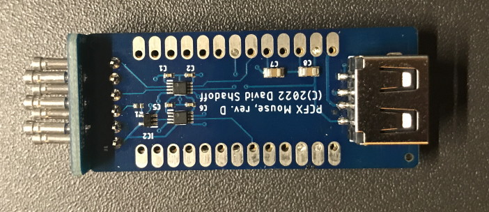

# PC-FX_Controller_Adapters - Projects designed for PC-FX controller ports

## [PC-FX USB Mouse adapter](https://github.com/pcfx-devel/PC-FX_Controller_Adapters/tree/main/PCFXMouse)

This allows a modern USB mouse to be used by a PC-FX machine.  The PC-FX did have a mouse which could be used on various
games, or even on the startup screen.  It was a mouse with a rotating ball and a cord (anybody familiar with this type of
mouse would be familiar with the desire to use a modern cordless optical mouse).

The RP2040 board is used as the USB Host for the mouse, and PIOs are used for signalling to the PC-FX console.

## Others

Other Projects are coming... the PIOs on the RPi Pico are very interesting and flexible, so will be well-suited to
retrocomputing/retrogaming projects.

## Notes

As soon as the Adafruit KB2040 board was released, I started using it for my projects, since it made the USB lines
available externally.  These are crucial for mounting alternate USB connectors (such as USB-A sockets for plugging in
mouse devices).

In future, I hope to design a more purpose-specific board with just the necessary parts and the RP2040 directly.

